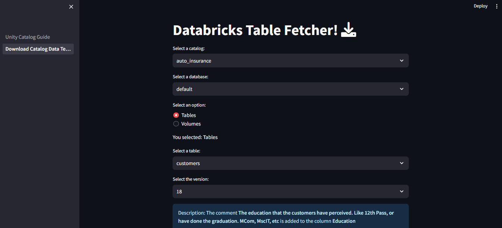
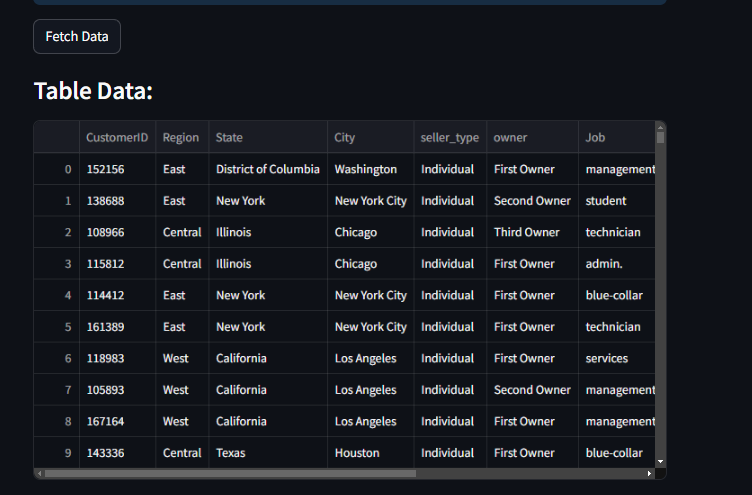
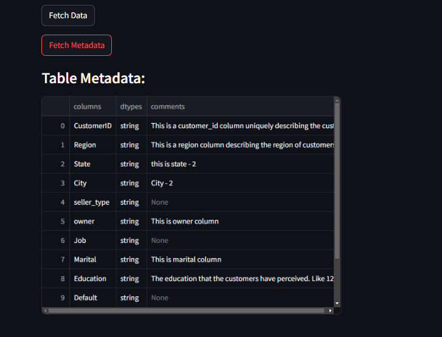
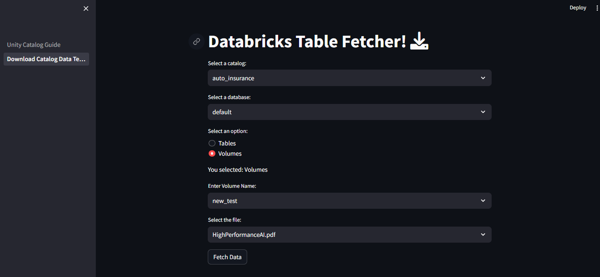

## databricks-api

This repository contains an API for performing Databricks operations via API. It provides functionality to interact with Unity Catalog, a centralized location for storing data on Databricks. Unity Catalog aims to address common issues faced by teams such as delays in accessing datasets, dependencies on team members for data availability, and lack of data dictionaries.

### Installation Guide

1. **Clone the repository:**
    ```bash
    git clone -b main https://github.com/mentorskool-org/databricks-api.git
    ```

2. **Switch to the repository directory:**
    ```bash
    cd databricks-api
    ```

3. **Create a virtual environment:**
    ```bash
    python -m venv <venv>
    ```
   Note: `<venv>` is the name of your virtual environment, provide any name.

4. **Activate the virtual environment:**

    - Powershell:
        ```powershell
        .\venv\Scripts\activate.ps1
        ```

    - Cmd:
        ```cmd
        .\venv\Scripts\activate.bat
        ```

5. **Install the requirements:**
    ```bash
    pip install -r requirements.txt
    ```

6. **Store Credentials:**
   
   - Rename the `.env.example` file to `.env` in your local GitHub directory. This file contains the schema for the necessary environment variables.
   - Fetch the credentials from the designated Slack channel and add them to the `.env` file. Ensure that you correctly fill in all required fields.

7. **Run the server:**
    ```bash
    streamlit run Unity_Catalog_Guide.py
    ```

    
    Once the server starts, navigate to the following tabs:

    - `Unity Catalog Guide`
    - `Download Catalog Data Template`

### Usage Guide

1. **Download Catalog Data Template:**

    - Select a catalog.
    - Choose a database within the selected catalog.
    - Select either tables or volumes.
    - For tables:
        - Choose a specific table.
        - Select a version (with description).
        - Click "Fetch Data" to download the data and "Fetch Metadata" for metadata.
    - For volumes:
        - Choose a volume.
        - Select a file to download.

    Note: Initial loading of the Download Catalog Data Template page may take 3 to 4 minutes as the cluster initializes. Subsequent interactions should be faster.

### Output

1. The output will be displayed after fetching data or metadata.
2. The volume files will be downloaded in the downloads folder.

Tables:


Fetch Data:


Fetch Metadata:


Volumes:



## Features

- Centralized storage of data on Databricks.
- Ability to fetch data and metadata efficiently.
- Streamlined access to datasets, reducing dependencies and delays.

## Requirements

- Python 3.x
- Dependencies listed in requirements.txt
- Access credentials for Databricks API

## Troubleshooting

- If the server fails to start, ensure that all dependencies are installed correctly and that access credentials are properly configured.